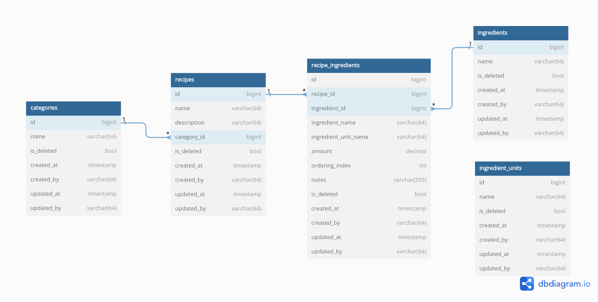
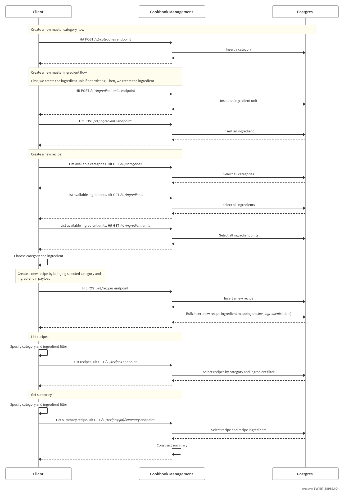
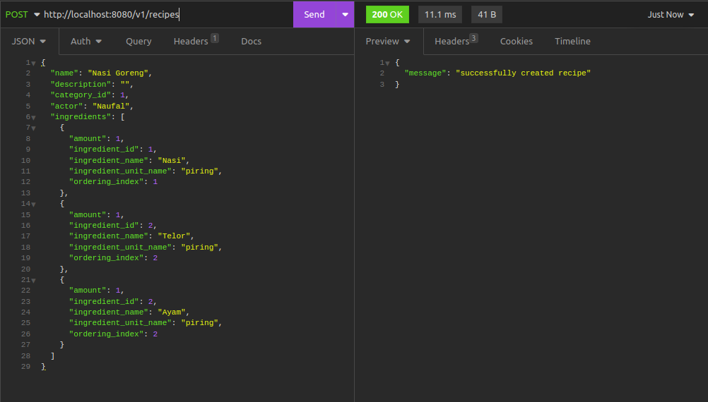
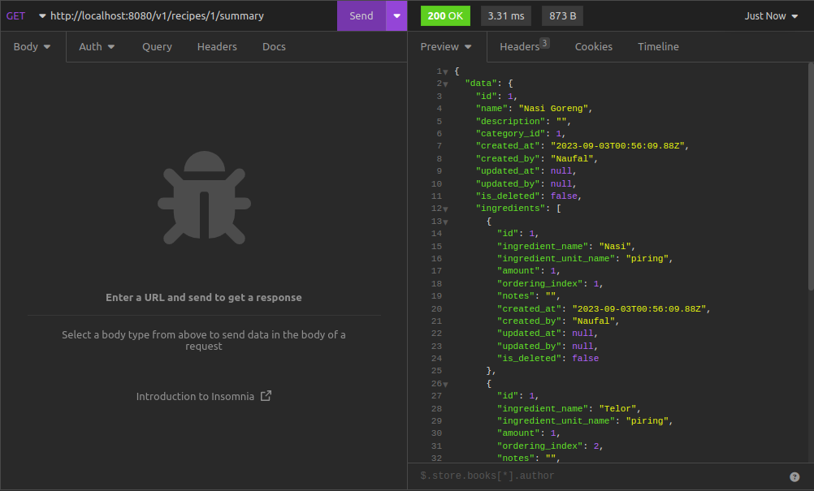
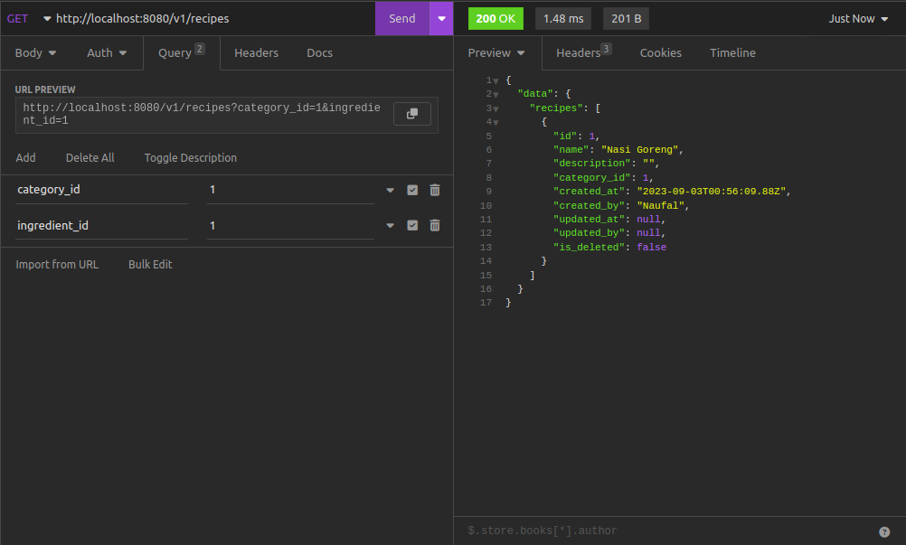

# Cookbook Management

### Summary

A service for managing cookbook. It uses Rest for communication and PostgreSQL for persistence. It follows Uncle Bob's Clean Architecture pattern (see [reference](https://blog.cleancoder.com/uncle-bob/2012/08/13/the-clean-architecture.html)) and modular monorepo for organizing the repository directories
           
### Database

The below image is our ERD,



_recipes_ is our table that holds recipes (e.g. nasi goreng) and has a many-to-many relationship with _ingredients_, which is connected by a bridging table called _recipe_ingredients_. This is to make ingredient data reusable. _recipe_ingredients_ contains ingredients data of a recipe and is sorted by an ordering index column to indicate cooking steps

On the other hand, _ingredients_, _categories_, and _ingredient_units_ are our master tables. 

Please note that we have some intended redundancies in the recipe_ingredients, e.g. _ingredient_name_ and _ingredient_unit_name_. This is to reduce joins when doing select operation.
            
### Flow

Secondly, the below image is our service flow,



You can find the Insomnia JSON here: https://drive.google.com/file/d/13qCMMrt-NQ9-XQyhIRzrPmx9MWYchkSx/view?usp=drive_link

You can import it to your Insomnia app and play around with our endpoints

The below images are sample of Insomnia request and response. First, we create a recipe and specifying its ingredients,



After that, we get the summary of the created recipe,



We also have an endpoint to list recipes with category and ingredient filter,

     
        
These are our complete list of endpoints,
  - "/v1/recipes/{id}/summary" Get GetRecipeSummary
  - "/v1/recipes" Get ListRecipes
  - "/v1/recipes" Post CreateRecipe
  - "/v1/recipes/{id}" Patch UpdateRecipe
  - "/v1/recipes/{id}" Delete DeleteRecipe
  - "/v1/recipe-ingredients" Post BulkCreateRecipeIngredients
  - "/v1/recipe-ingredients/{id}" Patch UpdateRecipeIngredient
  - "/v1/recipe-ingredients/{id}" Delete DeleteRecipeIngredient
  - "/v1/categories" Get ListCategories
  - "/v1/categories" Post CreateCategory
  - "/v1/categories/{id}" Patch UpdateCategory
  - "/v1/categories/{id}" Delete DeleteCategory
  - "/v1/ingredients" Get ListIngredients
  - "/v1/ingredients" Post CreateIngredient
  - "/v1/ingredients/{id}" Patch UpdateIngredient
  - "/v1/ingredients/{id}" Delete DeleteIngredient
  - "/v1/ingredient-units" Get ListIngredientUnits
  - "/v1/ingredient-units" Post CreateIngredientUnit
  - "/v1/ingredient-units/{id}" Patch UpdateIngredientUnit
  - "/v1/ingredient-units/{id}" Delete DeleteIngredientUnit

## Tech stacks
- Golang 1.20
- PostgreSQL (latest)

## Requirements
- Golang 1.20 See: https://go.dev/doc/install

## Setup
- Copy environment variables
```
cp env.sample .env
```

- Spin up dependencies using Docker
```
make compose-up
```

- Migrate database
```
make migrate up
```

- Run the Rest server
```
go run cmd/rest/main.go
```

Then, we can try our service on http://localhost:8080/

## Local development

To run all the unit tests, we can run this command,
```
make test
```

To run the linter, we can run this command,
```
make check
```

## Tech Debts
Please note that we have still some things to do due to the time constraint,
- Increase unit tests coverage
- Fix rest service in docker-compose. Currently, we encountered connection timeout when connecting Postgres. For now, we can spin up only postgres and run the app locally